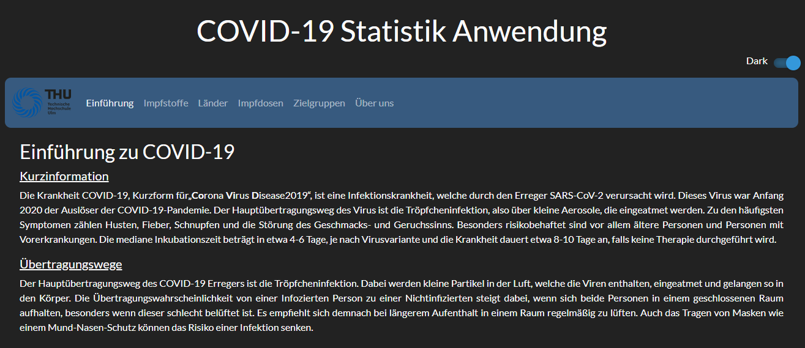
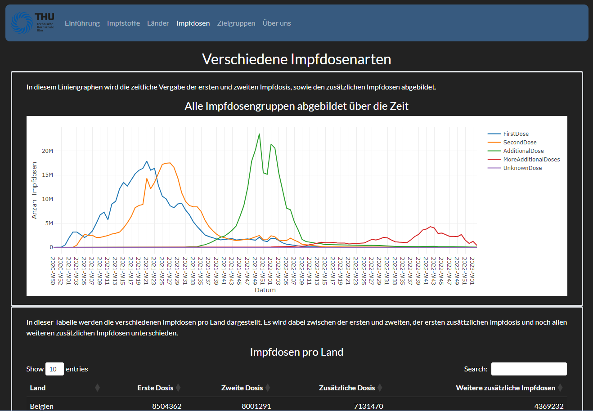

# COVID-19 Vaccination Data Visualization App (EU/EEA)

## Table of Contents
1. [Overview](#overview)
2. [Required R Packages](#required-r-packages)
3. [Usage](#usage)
4. [Explore Tabs](#explore-tabs)
   - [Introduction Tab](#introduction-tab)
   - [Vaccines Tab](#vaccines-tab)
   - [Countries Tab](#countries-tab)
   - [Doses Over Time Tab](#doses-over-time-tab)
   - [Target Groups Tab](#target-groups-tab)
   - [About Us Tab](#about-us-tab)
5. [Data Cleaning](#data-cleaning)
6. [Resources](#resources)
7. [References](#references)
8. [Project Information](#project-information)
9. [About Us](#about-us)
10. [Session Information](#session-information)

## Overview

Welcome to the COVID-19 Vaccination Data Visualization App for the European Union/European Economic Area (EU/EEA). This Shiny web application aims to provide insights into COVID-19 vaccination trends, distribution across countries, and dosage details.

## Required R Packages
* stringr
* bslib
* dplyr
* tibble
* readr
* shinyWidgets
* plotly
* ggplot2
* shiny
* DT

To run this Shiny app, you need to install the following R packages:

```R
install.packages(c("stringr", "bslib", "dplyr", "tibble", "readr", "shinyWidgets", "plotly", "ggplot2", "shiny", "DT"))
```

>Make sure to install these packages before running the app to ensure all dependencies are satisfied.

## Usage

1. **Clone the Project:**
   - Clone this repository to your local machine using the following command:
     ```bash
     git clone https://github.com/RShiny-App/rshiny-covid-app.git
     ```

2. **Navigate to the App Directory:**
   - Change to the `app` directory within the cloned repository.

3. **Run the Shiny App:**
   - Execute the appropriate R commands to run the Shiny app.

## Explore Tabs:

   - **Introduction Tab:**
      - Short introduction about COVID-19.

 

   - **Vaccines Tab:**
     - Analyze vaccination data by different vaccine types.
     - Tables display the overall most administered vaccines and those with the most additional doses.
     - Pie charts visually represent the data.


   - **Countries Tab:**
     - Visualize vaccination data by country.
     - Filter by target group.
     - Utilizes bar charts and tables to display total doses administered.
     - Choose specific target groups to narrow down the analysis.

 

   - **Doses Over Time Tab:**
     - Track doses over time using line graphs.
     - View trends for first doses, second doses, additional doses, and more.
     - Grouped by week and year.



   - **Target Groups Tab:**
     - Explore data based on different target groups.
     - Filter by country.
     - View a line graph illustrating total doses administered over time.
     - A pie chart displays the distribution of doses among various age groups.


   - **About Us Tab:**
     - Provides information about the project and the developers.


## Data Cleaning:
   - Refer to scripts in the `data_cleaning` directory for details on data preprocessing.

## Resources:
   - Raw data is stored in `resources/data.csv`.
   - Cleaned data is available in `resources/data_cleaned.csv`.
   - Additional project resources may be found in the `resources` directory.

## References:
   - Explore `references.txt` for documentation on references used in the project.


## Project Information

This project visualizes COVID-19 vaccination data collected through The European Surveillance System (TESSy) in the EU/EEA. Member States report basic indicators and data by target groups every four weeks. The app provides a user-friendly interface to explore and analyze vaccination trends.

## About Us

### About Our App

Welcome to the "Covid App," developed by students in the fifth semester of the [Data Science in Medicine program](https://www.thu.de/de/Seiten/Studiengang_DSM.aspx) at [Technische Hochschule Ulm](https://www.thu.de/de). This app was created as part of our project work in the elective course "Introduction to R and Shiny Apps" and serves as an examination performance.

### Developers

- **Yannik Krantz:** [GitHub Profile](https://github.com/Y4ng0)
- **Alexander Metzler:** [GitHub Profile](https://github.com/alxmtzr)
- **Florian Hauptmann:** [GitHub Profile](https://github.com/Flo3141)

### App Features

The "Covid App" offers an intuitive user interface to visualize data related to COVID-19 vaccinations in the countries of the European Union and the European Economic Area. The app presents comprehensive information about the distribution of vaccine doses, administration rates, and rejection statistics. 

### Dark mode and light mode

You can choose to use this app in light or dark mode by toggling the switch on the top right corner.

  


### Additional Information

* Visit [this website](https://www.ecdc.europa.eu/en/publications-data/data-covid-19-vaccination-eu-eea) for more information about the dataset.
* UI is in german language.


## Session Information

This Shiny app was developed and tested using the following R session:

```R
R version 4.3.1 (2023-06-16 ucrt)
Platform: x86_64-w64-mingw32/x64 (64-bit)
Running under: Windows 11 x64 (build 22621)
```
>See session_info.txt for a detailed list of R packages.

